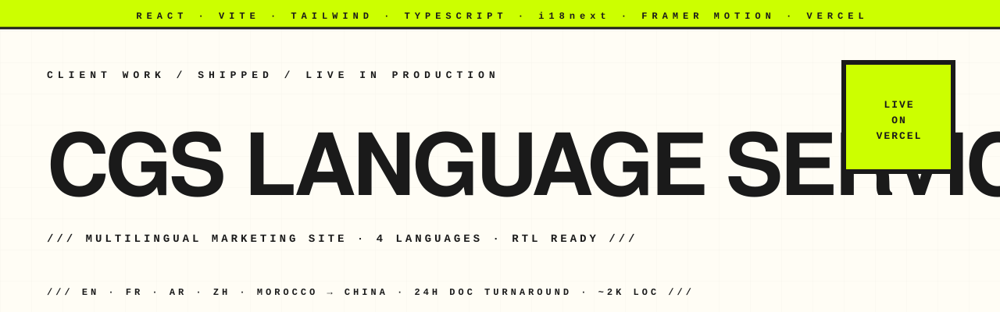

<p align="center">
  <picture>
    <source media="(prefers-color-scheme: dark)" srcset="assets/hero-banner-dark.svg" />
    
  </picture>
</p>

<p align="center">
  <a href="https://github.com/hatimhtm/cgs-language-services/actions/workflows/ci.yml"></a>
  <a href="https://cgs-language-services.vercel.app"></a>
  
  
  
  
</p>

<p align="center">
  <em>Multilingual marketing site for <strong>CGS Language Services</strong>: the document-translation division of <a href="https://www.cgs-language-services.vercel.app">China Global Study</a>. EN · FR · AR · ZH with full right-to-left support for Arabic, ~2,000 LOC of modern React 19 / Vite 8 / Tailwind 4, Framer Motion entrance animations, shipped to production on Vercel. Built for them on a freelance engagement.</em>
</p>

## The brief

CGS's parent agency, **China Global Study**, places students from Morocco and North Africa into Chinese universities. The brief: a marketing site for CGS's translation arm that

1. **Reads natively in all four operating languages**: English for the international/marketing layer, French for Moroccan students, Arabic (RTL) for the Maghreb, Chinese for university-side legitimacy.
2. **Sells one thing well**: 24-hour document translation accepted by Chinese universities. No service bloat, no portal sign-ups, just a WhatsApp-first funnel.
3. **Feels institutional**, not corporate-template. Layout, typography and motion had to look at home next to a university admissions page.

## Highlights

| | |
|---|---|
| **Four-language i18n** | `react-i18next` with full string-table split, language-aware HTML `dir` and `lang` attributes, `localStorage`-cached preference, navigator-language detection fallback |
| **Right-to-left support** | Arabic locale flips `dir="rtl"` at the root; Tailwind logical properties (`start-` / `end-`) keep layouts mirror-correct without per-component overrides |
| **React 19 + Vite 8 + TypeScript 6 + Tailwind 4** | Bleeding-edge stack; build is `tsc -b && vite build` for type-checking pass first |
| **Framer Motion polish** | Page transitions via `AnimatePresence`, staggered entrance animations on every section |
| **WhatsApp-first funnel** | Floating WhatsApp button, dedicated CTAs throughout, no contact form / portal friction |
| **Marketing-grade copy** | Strings live in `i18n/locales/*.json`: copy iterations don't touch JSX |
| **Zero-config Vercel deploy** | `vercel.json` + `_redirects` ship the SPA cleanly |

## Pages

- **Home**: Hero · trust strip · Services · Universities · Languages · Process · WhyUs · CTA
- **Services**: the four documents CGS specialises in (diploma · transcript · school certificate · criminal record), each with what's included
- **Process**: three steps in one working day; how to send a clean scan; what arrives back
- **About**: origin story (built inside the parent agency), values
- **Contact**: WhatsApp / email / office hours / what to have ready before messaging

## Stack

```
React 19      · vite 8 · TypeScript 6     · React Router 7
Tailwind 4    · framer-motion 12          · lucide-react
i18next 26    · i18next-browser-languagedetector · react-i18next 17
```

## Project layout

```
src/
├── App.tsx                    routes + locale sync
├── main.tsx
├── index.css                  Tailwind 4 root + paper-grid texture
├── pages/
│   ├── HomePage.tsx           composed of the home-section components
│   ├── ServicesPage.tsx
│   ├── ProcessPage.tsx
│   ├── AboutPage.tsx
│   └── ContactPage.tsx
├── components/
│   ├── Hero.tsx               headline + trust badge + faux-doc preview
│   ├── TrustStrip.tsx
│   ├── Services.tsx           four service cards
│   ├── Languages.tsx          EN · FR · AR · ZH samples
│   ├── Process.tsx            three-step timeline
│   ├── WhyUs.tsx              four reasons grid
│   ├── Universities.tsx       socials proof / logos
│   ├── CTA.tsx                bottom-of-page conversion
│   ├── Nav.tsx                language switcher + mobile menu
│   ├── Footer.tsx
│   ├── FloatingWhatsApp.tsx   sticky bottom-right CTA
│   ├── LanguageSwitcher.tsx
│   ├── PageHero.tsx           shared inner-page hero block
│   └── PageTransition.tsx     wraps every route in framer-motion
├── i18n/
│   ├── config.ts              languages table + i18next init
│   └── locales/{en,fr,ar,zh}.json
├── lib/
│   └── constants.ts           contact info (WhatsApp, email)
└── vite-env.d.ts
```

## Local dev

```bash
npm install
npm run dev      # http://localhost:5173
npm run build    # tsc -b && vite build
npm run preview  # serve the build at :4173
```

## Status

🟢 **Live at [cgs-language-services.vercel.app](https://cgs-language-services.vercel.app)**, shipped, in production, in use. Engagement complete; this repo is the public archive of the build.

---

<p align="center">
  <a href="https://hatimelhassak.is-a.dev">Portfolio</a> ·
  <a href="https://cal.com/hatimelhassak/engineering-discovery">Book a call</a> ·
  <a href="https://www.linkedin.com/in/hatim-elhassak/">LinkedIn</a> ·
  <a href="mailto:hatimelhassak.official@gmail.com">Email</a>
</p>
